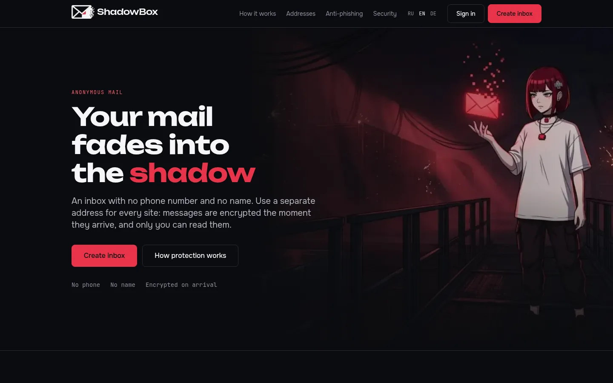
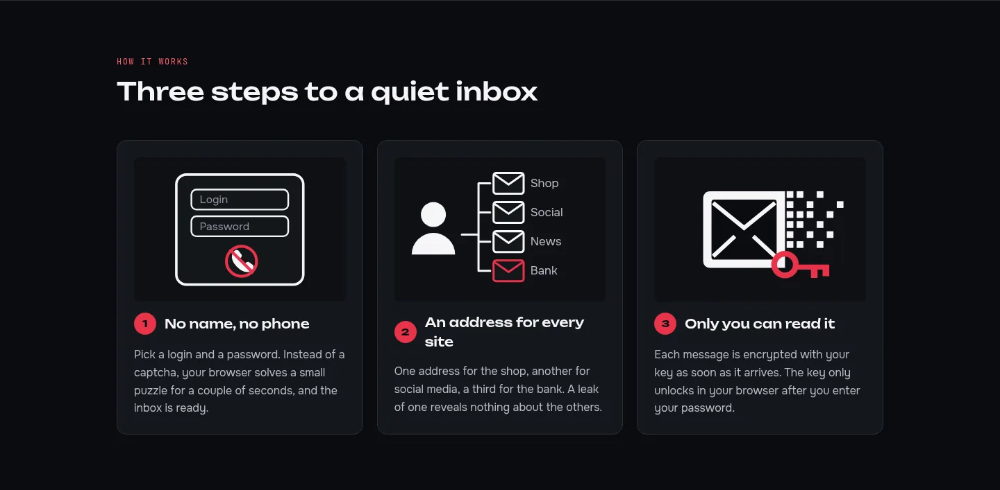
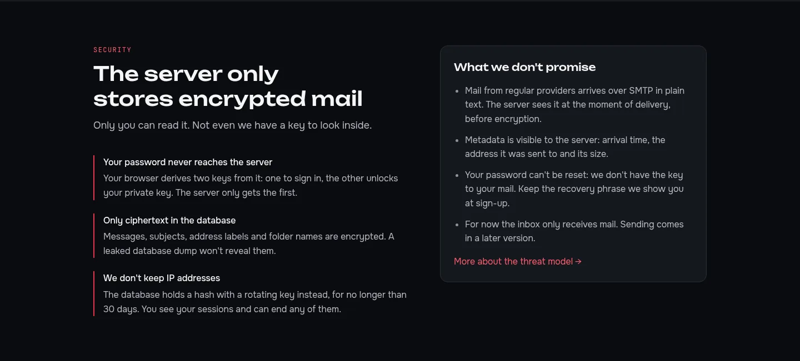
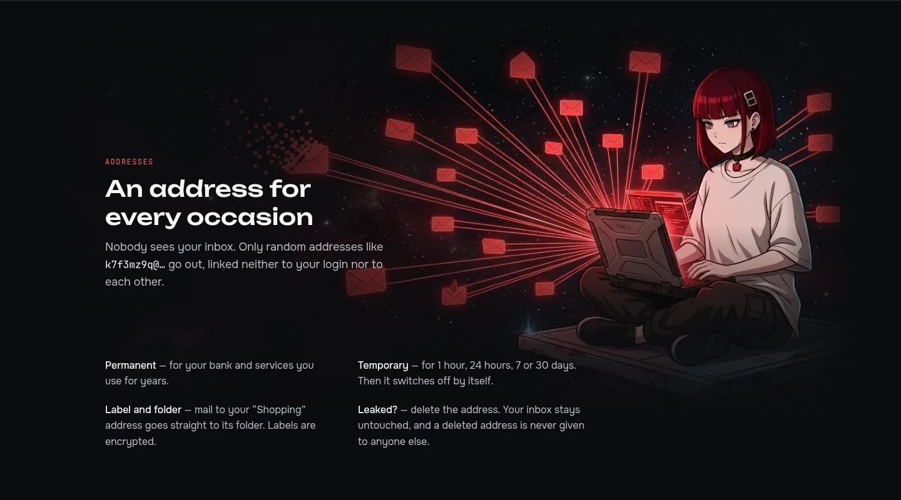
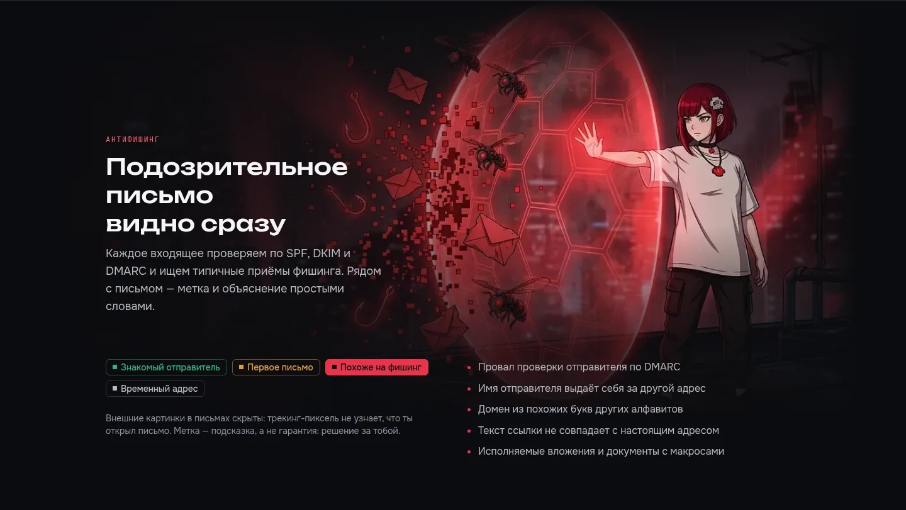
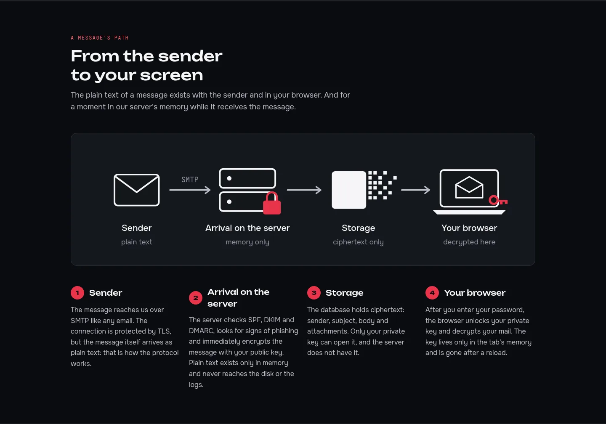
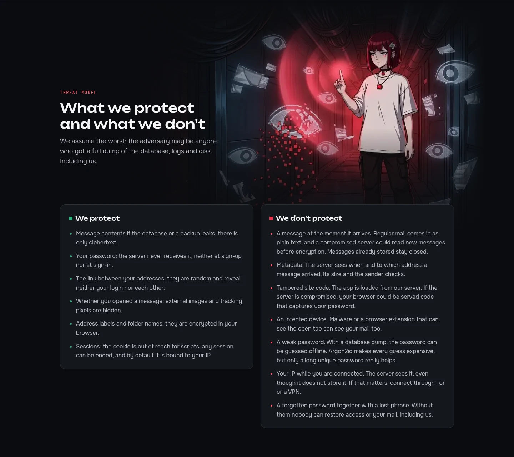
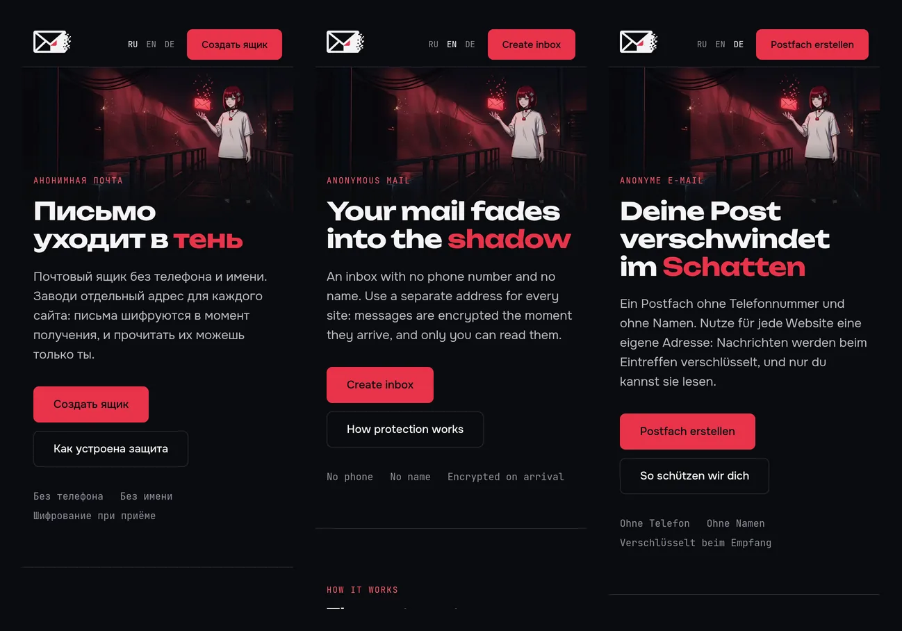

<p align="center">
  <a href="README.md">English</a> · <a href="README.ru.md">Русский</a> · <b>Deutsch</b>
</p>

<p align="center">
  
</p>

<h1 align="center">ShadowBox Frontend</h1>

<p align="center">
  <b>Der Web-Client von ShadowBox, einem Postfach, das deine Post nicht lesen kann.</b><br>
  Website, Registrierung, Postfach und die gesamte Kryptografie laufen im Browser.
</p>

<p align="center">
  
  
  
  
  
  
</p>

<p align="center">
  <a href="#screenshots">Screenshots</a> ·
  <a href="#prinzipien">Prinzipien</a> ·
  <a href="#technologien">Technologien</a> ·
  <a href="#struktur">Struktur</a> ·
  <a href="#entwicklung">Entwicklung</a> ·
  <a href="https://github.com/alexandra-seredkina/ShadowBox-Backend#readme">Projektüberblick und Backend</a>
</p>

---

## Über den Client

ShadowBox ist ein anonymes Postfach: Registrierung ohne Telefonnummer und Namen, eine eigene Adresse für jede Website, und jede Nachricht wird beim Eintreffen verschlüsselt. Der Server speichert nur Chiffretext, deshalb passieren Entschlüsselung und alles rund um Schlüssel hier, im Browser.

Projektziele, Bedrohungsmodell, Architektur und der Start der gesamten Umgebung stehen im [README des Backends](https://github.com/alexandra-seredkina/ShadowBox-Backend#readme).

## Screenshots

<p align="center">
  
</p>

<table>
  <tr>
    <td width="50%"></td>
    <td width="50%"></td>
  </tr>
  <tr>
    <td width="50%"></td>
    <td width="50%"></td>
  </tr>
  <tr>
    <td width="50%"></td>
    <td width="50%"></td>
  </tr>
</table>

<p align="center">
  <br>
  <sub>Mobile Ansicht in drei Sprachen</sub>
</p>

## Was schon da ist

- 🌐 **Startseite und Sicherheitsseite** auf Englisch, Russisch und Deutsch mit Sprachumschalter und `hreflang`. Die Sicherheitsseite erklärt, wie Post verschlüsselt wird, und sagt ehrlich, wovor wir nicht schützen.
- 🔐 **Kryptografie im Browser** mit libsodium: Schlüsselableitung mit Argon2id und HKDF, X25519-Schlüsselpaar, verschlüsselter privater Schlüssel, `EncryptedBlob` für Post und Metadaten, eine Recovery-Phrase aus 24 Wörtern. Schlüssel liegen nur im Speicher.
- ⛏ **Proof-of-Work** in einem Web Worker mit ehrlichem Fortschritt statt eines Captchas von Dritten.
- 🎨 **Designsystem** nach dem Brandbook: Farb-Tokens in `@theme`, dunkles Theme, Basiskomponenten (Buttons, Felder, Warnmarkierungen, Dialoge, Toasts).
- 🔌 **API-Client** mit zwei Implementierungen, `http` und `mock`. Die Mocks folgen dem API-Vertrag inklusive Fehlercodes und Latenz, sodass die Oberfläche ohne laufendes Backend entsteht.

**Als Nächstes:** Registrierung, Anmeldung und Entsperren, Adressen, Ordner, Post lesen.

## Prinzipien

| | Regel | Warum |
| --- | --- | --- |
| 🔑 | Schlüssel leben nur im Speicher des Tabs, nie in `localStorage`, IndexedDB oder Cookies | XSS oder Malware mit Zugriff auf den Browserspeicher bekommt den Schlüssel nicht. Nach einem Neuladen fragt das Postfach erneut nach dem Passwort |
| 🔒 | Das Passwort verlässt den Browser nie: daraus entstehen `authKey` für die Anmeldung und `encKey` für den privaten Schlüssel | Der Server kann die Post nicht entschlüsseln, selbst wenn er wollte |
| 🧱 | Strikte CSP mit Nonce pro Anfrage, ohne `unsafe-inline` und `unsafe-eval` für Skripte | Ein eingeschleustes Skript wird nicht ausgeführt |
| 📦 | Keine externen Ressourcen: Schriften, Bilder und Skripte kommen von unserem eigenen Origin | Keine CDNs, Analytics oder Tracker, die etwas über Besucher erfahren |
| 🖼 | HTML-Mails nur in einem isolierten `iframe` ohne Skripte, externe Bilder ausgeblendet | Tracking-Pixel erfahren nicht, dass eine Nachricht geöffnet wurde |
| 🌍 | Die Sprache kommt aus `Accept-Language` oder einem Link, ohne Cookie | Über Besucher gibt es nichts zu speichern |

## Technologien

| | |
| --- | --- |
| **Framework** | Next.js 16 (App Router), React 19, öffentliche Seiten als Server Components |
| **Styles** | Tailwind CSS 4, Marken-Tokens in `app/globals.css` |
| **Schriften** | Unbounded, Onest, JetBrains Mono, im Repo enthalten (OFL), der Build geht nie ins Netz |
| **Daten** | zod-Schemas für API-Antworten, eine Fehlerbehandlung nach `error.code` |
| **Kryptografie** | `libsodium-wrappers-sumo` (Argon2id, X25519, XChaCha20-Poly1305), HKDF aus WebCrypto, `@scure/bip39` für die Recovery-Phrase |
| **Qualität** | TypeScript mit allen strikten Flags, ESLint, Vitest, Semgrep, `npm audit`, Dependabot |

## Struktur

```
app/
├── [locale]/              en · ru · de
│   ├── layout.tsx         <html lang>, Metadaten, Open Graph
│   └── (marketing)/       Startseite, /security, Kopf- und Fußzeile
├── fonts/                 Markenschriften + OFL-Lizenzen
└── globals.css            Marken-Tokens
features/
├── crypto/                Schlüssel, EncryptedBlob, Recovery-Phrase, PoW-Worker
├── landing/ui/            Abschnitte der Startseite und SVG-Illustrationen
└── security/ui/           Abschnitte der Sicherheitsseite und das Diagramm des Nachrichtenwegs
shared/
├── api/                   HTTP-Client, Mocks, ApiError
├── config/                öffentliche Umgebungsvariablen
├── i18n/                  Sprachen, Auswahl per Accept-Language, Wörterbücher
└── ui/                    Basiskomponenten
proxy.ts                   CSP mit Nonce und Weiterleitung auf die Sprache
```

Ein neues Feature lebt in `features/<name>/` mit eigenem `ui/`, `model/` und `api/`. Seiten in `app/` setzen Features nur zusammen.

### Texte und Übersetzungen

Alle Texte der Oberfläche stehen in `shared/i18n/messages/{en,ru,de}.ts`, auch `aria-label`, Platzhalter und `alt`-Texte; Komponenten haben keine eigenen Texte. Das russische Wörterbuch gibt die Form vor, die anderen beiden müssen ihr entsprechen, ein fehlender Schlüssel ist also ein Kompilierfehler. Der Ton ist in allen Sprachen gleich: ruhig und per du.

## Entwicklung

Die gesamte Umgebung (nginx, API, Datenbank, Web) startet aus dem [Backend-Repository](https://github.com/alexandra-seredkina/ShadowBox-Backend#readme) mit `docker compose up --build` und läuft unter http://localhost:8080.

Nur das Frontend, ohne API, mit Mocks:

```bash
npm install
NEXT_PUBLIC_API_MODE=mock npm run dev
```

| Variable | Wert |
| --- | --- |
| `NEXT_PUBLIC_API_MODE` | `http` (Standard) oder `mock` |
| `NEXT_PUBLIC_SITE_URL` | Öffentliche Adresse der Website für Open-Graph-Links, z. B. `https://example.org` |

### Prüfungen

```bash
npm run typecheck
npm run lint
npm test
npm run build
```

Die CI führt sie bei jedem Pull Request zusammen mit Semgrep und `npm audit` aus.

### Bilder

Illustrationen liegen in `public/images/` als WebP ohne Metadaten. Im Markup nur über `next/image` mit expliziten Größen; enthält ein Bild Text, steht derselbe Text immer daneben im HTML.

## Lizenz

[AGPL-3.0](LICENSE). Schriften: [SIL Open Font License](app/fonts/).
