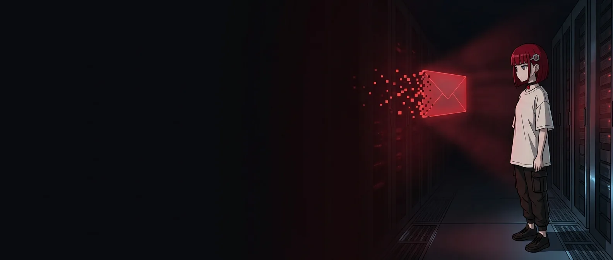
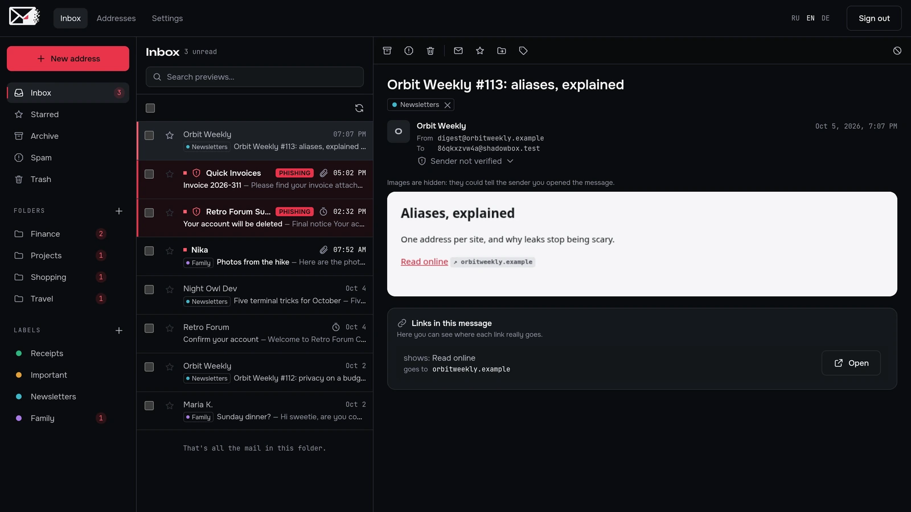
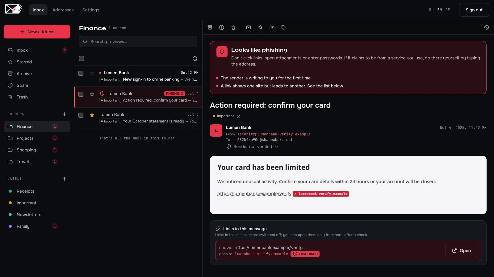
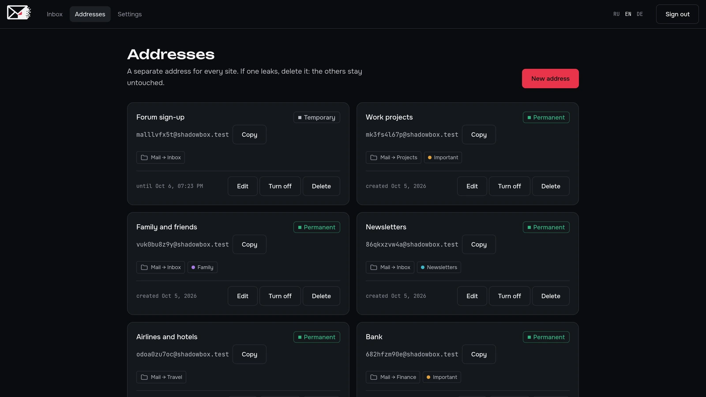

<p align="center">
  <b>English</b> · <a href="README.ru.md">Русский</a> · <a href="README.de.md">Deutsch</a>
</p>

<p align="center">
  
</p>

<h1 align="center">ShadowBox Frontend</h1>

<p align="center">
  <b>The web client of ShadowBox, a mailbox that cannot read your mail.</b><br>
  The website, sign-up, the inbox and all of the cryptography live in the browser.
</p>

<p align="center">
  
  
  
  
  
  
</p>

<p align="center">
  <a href="#screenshots">Screenshots</a> ·
  <a href="#principles">Principles</a> ·
  <a href="#tech-stack">Tech stack</a> ·
  <a href="#structure">Structure</a> ·
  <a href="#development">Development</a> ·
  <a href="https://github.com/alexandra-seredkina/ShadowBox-Backend#readme">Project overview and backend</a>
</p>

---

## About the client

ShadowBox is an anonymous mailbox: sign up without a phone number or a name, use a separate address for every site, and every message is encrypted the moment it arrives. The server only stores ciphertext, so decryption and everything that touches keys happens here, in the browser.

Project goals, the threat model, the architecture and how to run the whole stack are described in the [backend README](https://github.com/alexandra-seredkina/ShadowBox-Backend#readme).

## Screenshots

<p align="center">
  <br>
  <sub>Three panes: folders and labels, the list, the open message. Phishing is marked right in the list.</sub>
</p>

<table>
  <tr>
    <td width="50%"><br><sub>A phishing warning in plain words</sub></td>
    <td width="50%"><br><sub>An address for every site</sub></td>
  </tr>
</table>

## What is already there

- 📬 **A three-pane mailbox** like a desktop client: folders and labels on the left, compact two-line rows, the open message on the right. On a phone the folders slide in as a drawer.
- 🗂 **Folders and labels by address.** Pick a folder and labels for an address once, and its new mail is sorted on arrival. Starred, archive, bulk actions, search over decrypted previews.
- 🎣 **Phishing protection you can see.** A banner with the reasons in plain words, the sender's real address, SPF, DKIM and DMARC results, the real site next to every link, links switched off in dangerous mail, warnings for programs and macro documents.
- 🚫 **Blocking senders.** Their new mail goes straight to spam; the server keeps only a keyed hash and a copy sealed with your key.
- 🔐 **Client-side cryptography** on libsodium: Argon2id and HKDF key derivation, X25519 key pair, encrypted private key, `EncryptedBlob` for mail and metadata, a 24-word recovery phrase. Keys live only in memory.
- ⛏ **Proof-of-work** in a Web Worker with honest progress instead of a third-party captcha.
- 🌐 **Landing page and security page** in English, Russian and German, with a language switcher and `hreflang`.
- 🎨 **Design system** following the brand book: colour tokens in `@theme`, hand-drawn icons, Kage stickers in empty states, on the unlock screen and at sign-up.
- 🔌 **API client** with two implementations, `http` and `mock`. The mocks follow the API contract, so the UI can be built without a running backend.

**Next:** sending mail, recovery with the phrase.

## Principles

| | Rule | Why |
| --- | --- | --- |
| 🔑 | Keys live only in the tab's memory, never in `localStorage`, IndexedDB or cookies | XSS or malware with access to browser storage cannot take the key. After a reload the inbox asks for the password again |
| 🔒 | The password never leaves the browser: it yields `authKey` for sign-in and `encKey` for the private key | The server cannot decrypt mail even if it wanted to |
| 🧱 | Strict CSP with a per-request nonce, no `unsafe-inline` or `unsafe-eval` for scripts | An injected script will not run |
| 📦 | No external resources at all: fonts, images and scripts are served from our own origin | No CDNs, analytics or trackers that learn about the visitor |
| 🖼 | HTML mail only inside an isolated `iframe` without scripts, remote images hidden | Tracking pixels never learn that a message was opened |
| 🌍 | The language comes from `Accept-Language` or a link, no cookie | There is nothing to remember about the visitor |

## Tech stack

| | |
| --- | --- |
| **Framework** | Next.js 16 (App Router), React 19, public pages as Server Components |
| **Styles** | Tailwind CSS 4, brand tokens in `app/globals.css` |
| **Fonts** | Unbounded, Onest, JetBrains Mono, bundled in the repo (OFL), the build never goes online |
| **Data** | zod schemas for API responses, one error handler keyed by `error.code` |
| **Cryptography** | `libsodium-wrappers-sumo` (Argon2id, X25519, XChaCha20-Poly1305), WebCrypto HKDF, `@scure/bip39` for the recovery phrase |
| **Quality** | TypeScript with every strict flag, ESLint, Vitest, Semgrep, `npm audit`, Dependabot |

## Structure

```
app/
├── [locale]/              en · ru · de
│   ├── layout.tsx         <html lang>, metadata, Open Graph
│   ├── (app)/app/         mailbox, addresses, settings
│   └── (marketing)/       landing, /security, header and footer
├── fonts/                 brand fonts + OFL licences
└── globals.css            brand tokens
features/
├── alias/                 addresses, their folders and labels
├── auth/                  sign-up, sign-in, unlock, app gate
├── blocked-sender/        blocking senders, list in settings
├── crypto/                keys, EncryptedBlob, recovery phrase, PoW worker
├── folder/ · label/       folders and labels, encrypted names
├── landing/ui/            landing sections and SVG illustrations
├── mailbox/ui/            three-pane layout, sidebar, routing dialogs
├── message/               list, open message, link and attachment checks, sandboxed frame
└── security/ui/           security page sections and the mail-flow diagram
shared/
├── api/                   http client, mocks, ApiError
├── config/                public environment variables
├── i18n/                  locales, Accept-Language negotiation, dictionaries
└── ui/                    base components
proxy.ts                   CSP with nonce and locale redirect
```

A new feature lives in `features/<name>/` with its own `ui/`, `model/` and `api/`. Pages in `app/` only compose features.

### Texts and translations

Every interface string lives in `shared/i18n/messages/{en,ru,de}.ts`, including `aria-label`, placeholders and `alt` texts; components never hold copy of their own. The Russian dictionary defines the shape and the other two must match it, so a missing key is a compile error. The tone is the same in every language: calm and informal (“you” / „du“ / «ты»).

## Development

The whole stack (nginx, API, database, web) starts from the [backend repository](https://github.com/alexandra-seredkina/ShadowBox-Backend#readme) with `docker compose up --build` and opens at http://localhost:8080.

Frontend only, without the API, on mocks:

```bash
npm install
NEXT_PUBLIC_API_MODE=mock npm run dev
```

| Variable | Value |
| --- | --- |
| `NEXT_PUBLIC_API_MODE` | `http` (default) or `mock` |
| `NEXT_PUBLIC_SITE_URL` | Public site address for Open Graph links, e.g. `https://example.org` |

### Checks

```bash
npm run typecheck
npm run lint
npm test
npm run build
```

CI runs them on every pull request together with Semgrep and `npm audit`.

### Images

Illustrations live in `public/images/` as WebP without metadata. Markup uses them only through `next/image` with explicit sizes; if an image contains text, the same text is always next to it in HTML. Kage stickers for empty states live in `public/stickers/` as transparent WebP; they are decorative, so their `alt` is empty and the text next to them says the same.

## License

[AGPL-3.0](LICENSE). Fonts: [SIL Open Font License](app/fonts/).
